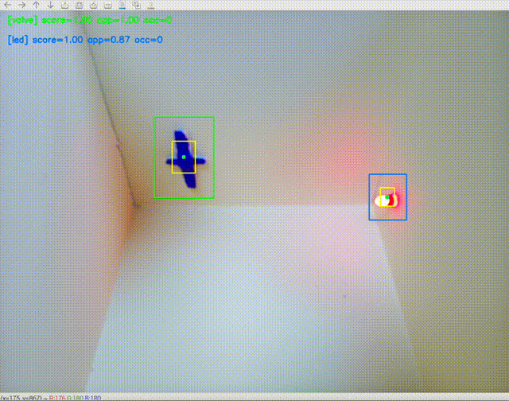

OpenEye CCTV
===
시설물 패턴 이상 징후 감지기
---
# 프로젝트 설명
아파트 시설물 관리 CCTV에 각 시설이 정해진 패턴에서 벗어났을 시 관제 시스템에 경고를 보내는 시스템 프로젝트.
아파트 시설물 관리를 위해 아파트 단지 내 cctv는 굉장히 많은 곳에 설치되어 있고 관리실의 중앙관제실에서 이를 관리한다. 하지만 cctv는 단순히 녹화 용으로 사용하기 때문에 아파트 단지 내에서 입주민이 시설물 관리 미흡으로 인해 사고를 당하게 되면 후에 확인 하는 용도로만 활용하게 되는 한계가 있고, 사고 후 보험 처리를 위해 녹화된 cctv로 서로의 입장을 입증해야 하는 갈등 상황이 발생되기도 한다.
opencv와 yolo를 사용하여 시설물의 패턴을 기억하고 패턴에서 벗어나게 될 때 중앙관제실 모니터에 경고 문구를 띄워 시설물 유지보수에 도움이 되고 고장난 시설물이 방치되지 않아 그로 인해 시설물 관리 비용 절감, 입주민의 안전을 확보한다.

## 기존 cctv 관제 시스템의 한계점
1. 단순 녹화.
2. 시설물에 이상이 생겼을 때 cctv로 발견하기 어렵기 때문에 경비원의 주기적인 순찰에 의지해야함. 순찰 시간 외에 고장이 나면 파악이 어려움.
3. 시설물 이상을 감지하지 못해 방치됐을 때 수리 골든타임을 놓쳐 비용이 더 드는 문제 발생. 장기간 입주민이 불편을 느낌.
4. 시설물의 고장을 파악하지 못해 장기간 방치 되었을 시 입주민의 안전 위협.
5. 사고 발생 시 사고 발생 후 원인 파악, 증거 입증 등으로만 활용이 가능함.

## 개선점
1. cctv 앵글에 들어와 있는 시설물의 패턴을 실시간 감지하여 패턴에서 일정 기준 이상 벗어난 경우 중앙관제시스템 모니터에  (*번 cctv의 위치) 경고 문구를 띄우는 실시간 감지 cctv
2. 실시간으로 시설물의 이상을 체크하므로 경비원의 순찰에만 의지하지 않고, 문제 발생 시점이 즉각 파악이 가능함.
3. 시설물 고장이 장기간 방치되는 것을 방지함. 적절한 수리 시기를 놓치지 않을 가능성이 높아지므로 유지보수 비용이 절감 되는 효과가 있음. 시설 고장으로 인해 입주민이 느끼는 불편한 기간을 줄일 수 있음.
4. 시설물 고장이 장기간 방치 되지 않음으로 입주민의 안전이 더 보장됨.
5. 사고 발생을 사전에 예방할 수 있고, 사고가 나더라도 정확한 원인을 데이터로 확실하게 파악 할 수 있음.

## 사용 하드웨어
- 개인 pc(맥북 프로(M1 pro), GPU 없음)
- 라즈베리파이 5 / piCam

## 주요 특징
- 템플릿 매칭, ROI 기반 감지
- 다중 템플릿 지원(현재 코드는 객체 2개까지 가능, 초기 설정 부분에 딕셔너리에 객채를 추가하면 추가 가능)

## 설치 방법
### 1. PC 환경
- 준비물: 웹캠, python 실행 환경, 필요한 패키지(requirements.txt 참조)
- 주의: 아래 순서대로 실행할 것.
### 템플릿 매칭용 이미지 저장 단계
- 반드시 웹캠을 연결한 상태로 실행한다.(코드에서 기본으로 외장 웹캠으로 설정되어 있음. 내장 웹캠을 사용할 경우 SOURCE = 1을 0으로 바꿔야 한다.)
- 웹캠을 고정한 상태에서 패턴을 감지할 물체를 웹캠 앵글에 들어오도록 한다.
- src/final/roi_select_multi.py 를 실행한다.
- 카메라 화면이 켜지면 'm'을 누르면 템플릿 저장 모드로 들어간다. 이때 카메라 화면은 멈춘 상태가 되고 마우스 드래그를 통해 원하는 갯수 만큼 템플릿을 저장할 수 있다.
- [roi_select_multi.py 실행화면(라즈베리파이 버전)]

- 마우스를 드래그하고 스페이스 or 엔터를 누르면 저장된다. 'c'를 누르면 템플릿 저장 취소. 템플릿을 다 설정했다면 esc를 눌러 프로그램 종료하면 "../assets/"에 파일이 저장된다.
### 패턴 이상 감지 cctv 실행 단계
- 템플릿 저장 단계에서 객체를 2개 이상 저장했다면 openey_cctv.py 코드 31번 라인 아래에 31번 라인의 양식대로 갯수에 맞게 딕셔너리에 추가한다.
- openeye_cctv.py를 실행하면 템플릿으로 지정한 객체에 네모난 박스가 생기면서 패턴을 감지하기 시작한다.
- [데모 영상]

- 객체가 자리에서 이탈하거나 위치가 회전하는 등 저장한 템플릿 이미지와 다른 모습을 보이면 패턴 이상으로 감지.
- 10초 유예 후 경고문 출력되면 정상 작동.
---
### 2. 라즈베리파이 환경
- 준비물: 라즈베리 파이, 파이캠
- 주의: 아래 순서대로 실행할 것. 
### 템플릿 매칭용 이미지 저장 단계
- 반드시 파이캠을 연결한 상태로 실행한다.
- 파이캠을 고정한 상태에서 패턴을 감지할 물체를 파이캠 앵글에 들어오도록 한다.
- /raspi_openeye_cctv/src/roi_select_multi.py 를 실행한다.
- 카메라 화면이 켜지면 'm'을 누르면 템플릿 저장 모드로 들어간다. 이때 카메라 화면은 멈춘 상태가 되고 마우스 드래그를 통해 템플릿을 지정할 수 있다.
- [roi_select_multi.py 실행화면]

- 마우스를 드래그하고 스페이스 or 엔터를 누르면 저장된다. 'c'를 누르면 템플릿 저장 취소. 템플릿을 다 설정했다면 esc를 눌러 프로그램 종료하면 "../assets/"에 파일이 저장된다.
### 패턴 이상 감지 cctv 실행 단계
- 템플릿 저장 단계에서 객체를 2개 이상 저장했다면 openey_cctv.py 코드 31번 라인 아래에 31번 라인의 양식대로 갯수에 맞게 딕셔너리에 추가한다.
- openeye_cctv.py를 실행하면 템플릿으로 지정한 객체에 네모난 박스가 생기면서 패턴을 감지하기 시작한다.
- [데모 영상]

- 객체가 자리에서 이탈하거나 위치가 회전하는 등 저장한 템플릿 이미지와 다른 모습을 보이면 패턴 이상으로 감지.
- 10초 유예 후 경고문 출력되면 정상 작동.
---
## 디오라마로 구현

